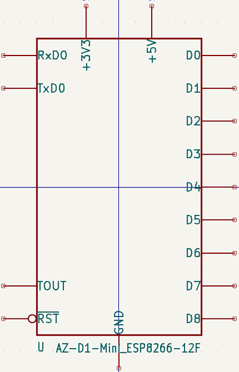

## List of supported components

If a component you need is missing from this list, please create a pull request or file an issue (see [contributing guidelines](https://github.com/nkappler/KiCAD-AZDelivery#contributing))

- [GY-521 MPU-6050](https://www.azde.ly/products/gy-521-6-achsen-gyroskop-und-beschleunigungssensor)
- [Real Time Clock RTC DS3231 I2C](https://www.azde.ly/products/ds3231-real-time-clock)
- [SPI Reader Micro SD](https://www.azde.ly/products/copy-of-spi-reader-micro-speicherkartenmodul-fur-arduino)

### Mini power supplies 
- [Mini Power Supply AC/DC 230V/12V](https://www.azde.ly/products/220v-zu-12v-mini-netzteil)
- [Mini Power Supply AC/DC 230V/5V](https://www.azde.ly/products/copy-of-220v-zu-5v-mini-netzteil)
- [Mini Power Supply AC/DC 230V/3.3V](https://www.azde.ly/products/220v-zu-3-3v-mini-netzteil)

### AZ D1 Mini module

The 3D model of the D1 mini was taken from the github repo [rubienr / wemos-d1-mini-kicad](https://github.com/rubienr/wemos-d1-mini-kicad). Thank you for excellent job of the contributors.

- [AZ D1 Mini NodeMcu with ESP8266-12F WiFi Module](https://www.azde.ly/products/d1-mini)
-  [ESP8266MOD/ESP12F Datasheet](https://docs.ai-thinker.com/_media/esp8266/docs/esp-12f_product_specification.pdf)
  - [ESP8266 Reference manual](https://www.espressif.com/sites/default/files/documentation/esp8266-technical_reference_en.pdf)

### AZ OLED 0.66" Display shield

- [AZ 0,66 Oled Display Shield](https://www.azde.ly/products/0-66-oled-display-shield)

### AZ OLED 0.96" 128x644

This component is based on the work of "Rsomething " and was taken from the github repo [the-this-pointer/kicad-my-libraries](https://github.com/the-this-pointer/kicad-my-libraries) Thank you for excellent job, especially for the 3D-Models. Please see the REAME.md in his repo for more information.

- [AZ 0,69 Oled 128x64](https://www.az-delivery.de/products/0-96zolldisplay)

### AZ OLED 1.3"128x644

This component is based on the work of "Rsomething " and was taken from the github repo [the-this-pointer/kicad-my-libraries](https://github.com/the-this-pointer/kicad-my-libraries) Thank you for excellent job, especially for the 3D-Models. Please see the REAME.md in his repo for more information.

- [AZ 1,3 Oled 128x64](https://www.az-delivery.de/products/1-3zoll-i2c-oled-display)

