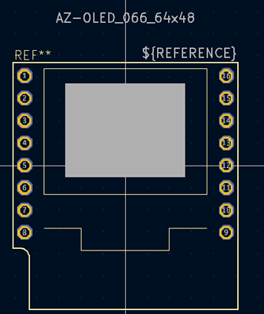

## List of supported components

If a component you need is missing from this list, please create a pull request or file an issue (see [contributing guidelines](https://github.com/nkappler/KiCAD-AZDelivery#contributing))

- [GY-521 MPU-6050](https://www.azde.ly/products/gy-521-6-achsen-gyroskop-und-beschleunigungssensor)
- [Real Time Clock RTC DS3231 I2C](https://www.azde.ly/products/ds3231-real-time-clock)
- [SPI Reader Micro SD](https://www.azde.ly/products/copy-of-spi-reader-micro-speicherkartenmodul-fur-arduino)

- [Mini Power Supply AC/DC 230V/12V](https://www.azde.ly/products/220v-zu-12v-mini-netzteil)
- [Mini Power Supply AC/DC 230V/5V](https://www.azde.ly/products/copy-of-220v-zu-5v-mini-netzteil)
- [Mini Power Supply AC/DC 230V/3.3V](https://www.azde.ly/products/220v-zu-3-3v-mini-netzteil)

- [AZ D1 Mini NodeMcu with ESP8266-12F WiFi Module](https://www.azde.ly/products/d1-mini)
  [ESP8266MOD/ESP12F Datasheet](https://docs.ai-thinker.com/_media/esp8266/docs/esp-12f_product_specification.pdf)
  [ESP8266 Reference manual](https://www.espressif.com/sites/default/files/documentation/esp8266-technical_reference_en.pdf)

- [AZ 0,66 Oled Display Shield](https://www.azde.ly/products/0-66-oled-display-shield)

